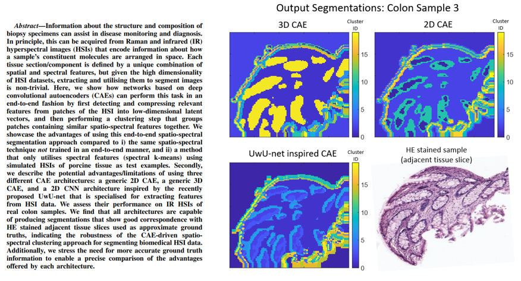
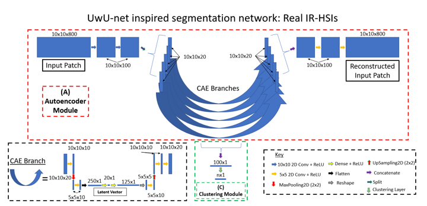

# Code Repository  
# Unsupervised segmentation of biomedical hyperspectral image data: tackling high dimensionality with convolutional autoencoders  

Ciaran Bench, Jayakrupakar Nallala, Chun-Chin Wang, Hannah Sheridan, Nicholas Stone  
School of Physics and Astronomy, University of Exeter, Exeter, UK  

  

This repository contains i) python files used to train/evaluate segmentation networks, ii) som results, and iii) code used to analyse network outputs. Some NMI score/ARS values and CAE+k-means images may differ slightly from those seen in the paper, as a fixed seed was not used to run k-means.  

Arrays of pre-parsed HSI patches are loaded in for use as inputs. These arrays are not included in this repo.

### CAE+k-means clustering  
After the pretraining stage, a .mat file 'encoded_imgs_pretrain.mat' containing the latent vector for each patch is saved. k-means clustering is used to acquire the resultant segmentation image.  

### End-to-end clustering  
A model file from the pretraining stage mentioned above is loaded, and the autoencoder module and clustering module are trained together. Once training is complete, a .mat file 'cluster_out_train.mat' is saved, which contains the cluster ID for each input patch.  

#### References
Much of the network code was adapted from the following resources:

[X. Guo, X. Liu, E. Zhu, and J. Yin, “Deep clustering with convolutional autoencoders,” in International conference on neural information
processing, pp. 373–382, Springer, 2017.](https://xifengguo.github.io/papers/ICONIP17-DCEC.pdf)  
MIT license. Copyright (c) 2020 Xifeng Guo

[B. Manifold, S. Men, R. Hu, and D. Fu, “A versatile deep learning
architecture for classification and label-free prediction of hyperspectral
images,” Nature machine intelligence, vol. 3, no. 4, pp. 306–315, 2021.](https://doi.org/10.1038%2Fs42256-021-00309-y)
Allen Institute Software License Copyright © 2018. Allen Institute.
